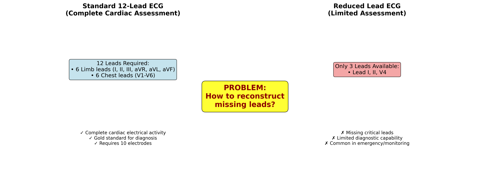
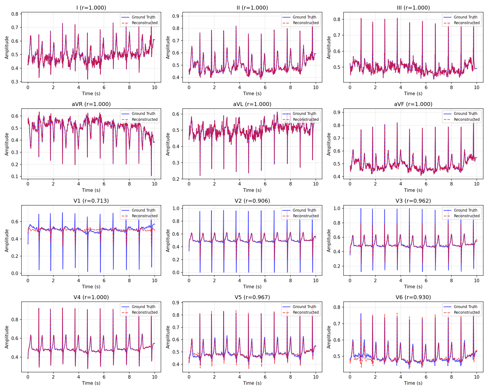
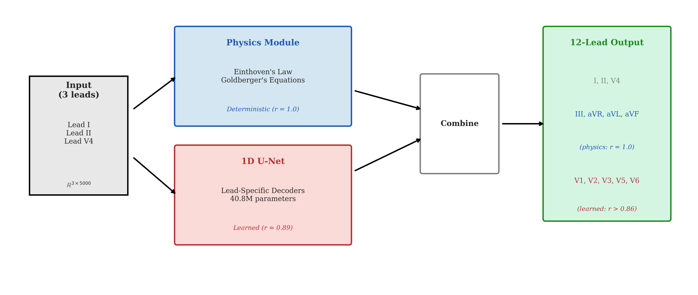
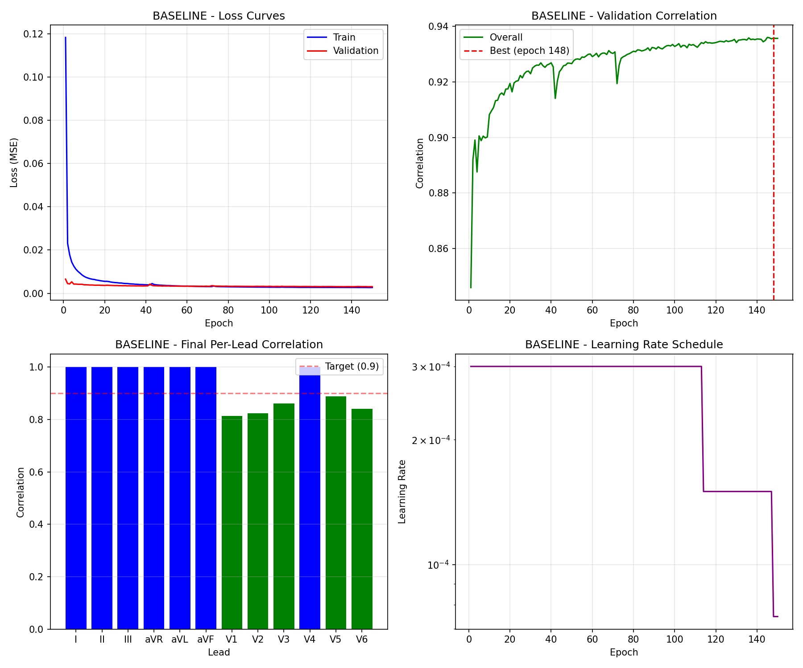

# 12-Lead ECG Reconstruction from Reduced Lead Sets

[](https://www.python.org/downloads/)
[](https://pytorch.org/)
[](https://opensource.org/licenses/MIT)

> A hybrid physics-informed deep learning approach to reconstruct the full 12-lead ECG from only 3 measured leads (I, II, V4).

**DATA 5000 Final Project** | Carleton University | December 2025

**Authors:** Damilola Olaiya & Mithun Manivannan

---

## Table of Contents

- [Abstract](#abstract)
- [Results](#results)
  - [Summary Metrics](#summary-metrics)
  - [Per-Lead Performance](#per-lead-performance)
- [Methodology](#methodology)
  - [Physics-Based Component](#physics-based-component)
  - [Deep Learning Component](#deep-learning-component)
  - [Architecture Overview](#architecture-overview)
- [Key Findings](#key-findings)
- [Getting Started](#getting-started)
  - [Prerequisites](#prerequisites)
  - [Installation](#installation)
  - [Quick Test](#quick-test)
  - [Training](#training)
  - [Evaluation](#evaluation)
- [Dataset](#dataset)
  - [PTB-XL Overview](#ptb-xl-overview)
  - [Data Splits](#data-splits)
- [Repository Structure](#repository-structure)
- [Configuration Options](#configuration-options)
- [Documentation](#documentation)
- [References](#references)
- [Citation](#citation)
- [License](#license)
- [Acknowledgments](#acknowledgments)

---

## Abstract

The standard 12-lead electrocardiogram (ECG) remains the gold standard for cardiac diagnostics, but requires 10 physical electrodes and specialized equipment. This work presents a hybrid physics-informed deep learning approach that reconstructs the complete 12-lead ECG from only 3 measured leads (I, II, V4). The method exploits Einthoven's law and Goldberger's equations for deterministic reconstruction of limb leads, while a 1D U-Net architecture learns to reconstruct the remaining precordial leads. Evaluated on the PTB-XL dataset (21,837 recordings), our approach achieves an overall Pearson correlation of r = 0.936 with clinical-grade signal quality (SNR = 63.0 dB).

<p align="center">
  
</p>
<p align="center"><em>Figure 1: 3-lead to 12-lead ECG reconstruction problem formulation</em></p>

---

## Results

### Summary Metrics

| Metric | Value |
|--------|-------|
| Overall Correlation | r = 0.936 |
| Learned Leads (V1-V3, V5-V6) | r = 0.846 |
| Mean Absolute Error | 0.012 |
| Signal-to-Noise Ratio | 63.0 dB |
| Model Parameters | 17.1M |

### Per-Lead Performance

| Lead | Correlation (r) | MAE | SNR (dB) |
|:----:|:---------------:|:---:|:--------:|
| V1 | 0.818 | 0.030 | 19.5 |
| V2 | 0.827 | 0.030 | 19.3 |
| V3 | 0.860 | 0.027 | 20.0 |
| V5 | **0.891** | 0.026 | 20.3 |
| V6 | 0.836 | 0.033 | 18.3 |

<p align="center">
  
</p>
<p align="center"><em>Figure 2: Reconstruction quality across all leads (physics-based vs. learned)</em></p>

<details>
<summary><strong>View Reconstruction Examples</strong></summary>

<p align="center">
  
</p>
<p align="center"><em>Example reconstruction showing ground truth vs. predicted signals</em></p>

</details>

---

## Methodology

### Physics-Based Component

The limb leads are mathematically related through Einthoven's law and Goldberger's equations, enabling exact reconstruction with zero learned parameters:

| Output Lead | Formula |
|:-----------:|:--------|
| III | Lead II - Lead I |
| aVR | -(Lead I + Lead II) / 2 |
| aVL | Lead I - (Lead II / 2) |
| aVF | Lead II - (Lead I / 2) |

### Deep Learning Component

A 1D U-Net architecture reconstructs the precordial leads (V1, V2, V3, V5, V6) from the three input leads (I, II, V4):

| Property | Value |
|----------|-------|
| Architecture | 1D U-Net with skip connections |
| Encoder Depth | 4 levels |
| Base Features | 64 channels |
| Parameters | 17.1M |
| Loss Function | L1 (Mean Absolute Error) |

### Architecture Overview

<p align="center">
  
</p>
<p align="center"><em>Figure 3: Hybrid physics-informed deep learning architecture</em></p>

<details>
<summary><strong>Text Diagram</strong></summary>

```
                    +-------------------------------------+
                    |     INPUT: 3 Measured Leads        |
                    |       Lead I, Lead II, Lead V4     |
                    +-----------------+-------------------+
                                      |
                        +-------------+-------------+
                        |                           |
                        v                           v
              +------------------+        +------------------+
              |  PHYSICS MODULE  |        |    1D U-Net      |
              |                  |        |                  |
              |  Einthoven's &   |        |  Encoder-Decoder |
              |  Goldberger's    |        |  Architecture    |
              |  Equations       |        |                  |
              |                  |        |                  |
              |  Output:         |        |  Output:         |
              |  III, aVR,       |        |  V1, V2, V3,     |
              |  aVL, aVF        |        |  V5, V6          |
              +--------+---------+        +---------+--------+
                       |                            |
                       +------------+---------------+
                                    |
                                    v
                    +-------------------------------------+
                    |    OUTPUT: Complete 12-Lead ECG    |
                    +-------------------------------------+
```

</details>

---

## Key Findings

<details>
<summary><strong>1. Physics Constraints Enable Perfect Limb Lead Reconstruction</strong></summary>

Four of twelve leads (III, aVR, aVL, aVF) are reconstructed with r = 1.000 using only algebraic transformations, requiring zero learned parameters. This deterministic approach provides computational efficiency and eliminates reconstruction error for one-third of the output leads.

</details>

<details>
<summary><strong>2. Shared Decoder Outperforms Lead-Specific Decoders</strong></summary>

Counter-intuitively, a shared decoder architecture (17.1M parameters) significantly outperforms lead-specific decoders (40.8M parameters):
- Cohen's d = 0.92 (large effect size)
- p-value < 0.001
- Suggests shared representations capture cross-lead dependencies more effectively

</details>

<details>
<summary><strong>3. Information Bottleneck Limits Performance</strong></summary>

Reconstruction quality is fundamentally bounded by the ground-truth inter-lead correlations:
- **V5** achieves best performance (r = 0.891): anatomically adjacent to input V4 (ground-truth correlation = 0.79)
- **V1** is most challenging (r = 0.818): anatomically distant from V4 (ground-truth correlation = 0.49)

**Implication:** Input lead selection is more critical than model architecture for maximizing reconstruction quality.

</details>

<details>
<summary><strong>4. Training Convergence Analysis</strong></summary>

<p align="center">
  
</p>
<p align="center"><em>Training and validation loss over epochs</em></p>

The model converges smoothly without overfitting, with validation loss closely tracking training loss throughout the optimization process.

</details>

<details>
<summary><strong>5. Inter-Lead Correlation Analysis</strong></summary>

<p align="center">
  
</p>
<p align="center"><em>Ground-truth inter-lead correlations in PTB-XL dataset</em></p>

The heatmap reveals the fundamental information structure: precordial leads (V1-V6) show strong mutual correlations, while limb and precordial lead groups are more weakly coupled.

</details>

---

## Getting Started

### Prerequisites

- Python 3.9+
- PyTorch 2.0+
- CUDA-capable GPU (recommended)

### Installation

```bash
git clone https://github.com/whiteblaze143/DATA_5000.git
cd DATA_5000
pip install -r requirements.txt
```

### Quick Test

Verify installation with synthetic data:

```bash
python run_training.py --test_mode
```

### Training

<details>
<summary><strong>Step 1: Download PTB-XL Dataset</strong></summary>

```bash
python scripts/download_ptb_xl.py
```

This downloads the PTB-XL dataset (~2GB) from PhysioNet.

</details>

<details>
<summary><strong>Step 2: Run Training</strong></summary>

```bash
python run_training.py \
    --data_dir data/ptb_xl \
    --output_dir models/my_experiment \
    --epochs 150 \
    --batch_size 128 \
    --lr 3e-4
```

</details>

### Evaluation

Evaluate a trained model:

```bash
python scripts/quick_eval.py --model_path models/final_exp_baseline/best_model.pt
```

---

## Dataset

### PTB-XL Overview

We use the [PTB-XL dataset](https://physionet.org/content/ptb-xl/1.0.3/), a large publicly available electrocardiography dataset:

| Attribute | Value |
|-----------|-------|
| Total Records | 21,837 |
| Unique Patients | 18,885 |
| Recording Duration | 10 seconds |
| Sampling Rate | 500 Hz |
| Leads | 12 (standard clinical configuration) |
| Annotations | Diagnostic labels, signal quality |

### Data Splits

Patient-wise stratified splits prevent data leakage between partitions:

| Split | Records | Percentage | Purpose |
|-------|---------|------------|----------|
| Train | 14,363 | 70% | Model optimization |
| Validation | 1,914 | 15% | Hyperparameter tuning |
| Test | 1,932 | 15% | Final evaluation |

<details>
<summary><strong>View Sample ECG Signal</strong></summary>

<p align="center">
  
</p>
<p align="center"><em>Sample 12-lead ECG from PTB-XL dataset</em></p>

</details>

---

## Repository Structure

<details>
<summary><strong>Click to expand</strong></summary>

```
DATA_5000/
|
+-- run_training.py              # Main training entry point
+-- train.sh                     # Shell script for VM training
+-- requirements.txt             # Python dependencies
+-- pyproject.toml               # Project configuration
|
+-- src/                         # Source code
|   +-- config.py               # Configuration management
|   +-- physics.py              # Einthoven/Goldberger equations
|   +-- train.py                # Training loop implementation
|   +-- evaluation.py           # Metrics (MAE, correlation, SNR)
|   +-- utils.py                # Utility functions
|   +-- models/
|       +-- unet_1d.py          # 1D U-Net architecture
|       +-- baseline.py         # Baseline model implementations
|
+-- data/                        # Data handling
|   +-- data_modules.py         # PyTorch Dataset/DataLoader
|   +-- get_data.py             # Data preparation utilities
|   +-- generate_test_data.py   # Synthetic data generation
|   +-- README_DATA.md          # Data documentation
|
+-- scripts/                     # Utility scripts
|   +-- download_ptb_xl.py      # PTB-XL download script
|   +-- quick_eval.py           # Model evaluation script
|
+-- models/                      # Trained models
|   +-- final_exp_baseline/
|       +-- best_model.pt       # Best model weights
|       +-- test_results.json   # Evaluation metrics
|
+-- docs/                        # Documentation
    +-- PROJECT_REPORT.tex      # LaTeX report source
    +-- PROJECT_REPORT.pdf      # Compiled report
    +-- references.bib          # Bibliography
    +-- figures/                # Report figures
```

</details>

---

## Configuration Options

| Argument | Default | Description |
|----------|---------|-------------|
| `--data_dir` | `data/ptb_xl` | Path to PTB-XL dataset |
| `--output_dir` | `models/exp` | Output directory for model checkpoints |
| `--epochs` | 150 | Number of training epochs |
| `--batch_size` | 128 | Training batch size |
| `--lr` | 3e-4 | Learning rate |
| `--features` | 64 | Base feature count for U-Net |
| `--depth` | 4 | U-Net encoder/decoder depth |
| `--dropout` | 0.2 | Dropout rate for regularization |
| `--amp` | False | Enable automatic mixed precision |

---

## Documentation

| Document | Description |
|----------|-------------|
| [PROJECT_REPORT.pdf](docs/PROJECT_REPORT.pdf) | Full academic report with methodology, experiments, and analysis |

<details>
<summary><strong>Compiling LaTeX Report</strong></summary>

```bash
cd docs
pdflatex PROJECT_REPORT.tex
bibtex PROJECT_REPORT
pdflatex PROJECT_REPORT.tex
pdflatex PROJECT_REPORT.tex
```

</details>

---

## References

1. Wagner, P., et al. (2020). PTB-XL, a large publicly available electrocardiography dataset. *Scientific Data*, 7(1), 154.

2. Mason, F., et al. (2024). AI-enhanced reconstruction of the 12-lead ECG via 3-leads. *npj Digital Medicine*, 7(1), 1-12.

3. Ronneberger, O., Fischer, P., & Brox, T. (2015). U-Net: Convolutional Networks for Biomedical Image Segmentation. *MICCAI*, 234-241.

---

## Citation

If you use this code or methodology in your research, please cite:

```bibtex
@misc{olaiya2025ecg,
  author       = {Olaiya, Damilola and Manivannan, Mithun},
  title        = {12-Lead ECG Reconstruction from Reduced Lead Sets: 
                  A Hybrid Physics-Informed Deep Learning Approach},
  year         = {2025},
  institution  = {Carleton University},
  howpublished = {\url{https://github.com/whiteblaze143/DATA_5000}}
}
```

---

## License

This project is licensed under the MIT License. See [LICENSE](LICENSE) for details.

---

## Acknowledgments

- DATA 5000 course instructors and teaching assistants at Carleton University
- [PhysioNet](https://physionet.org/) for providing open access to the PTB-XL dataset
- The PyTorch development team
